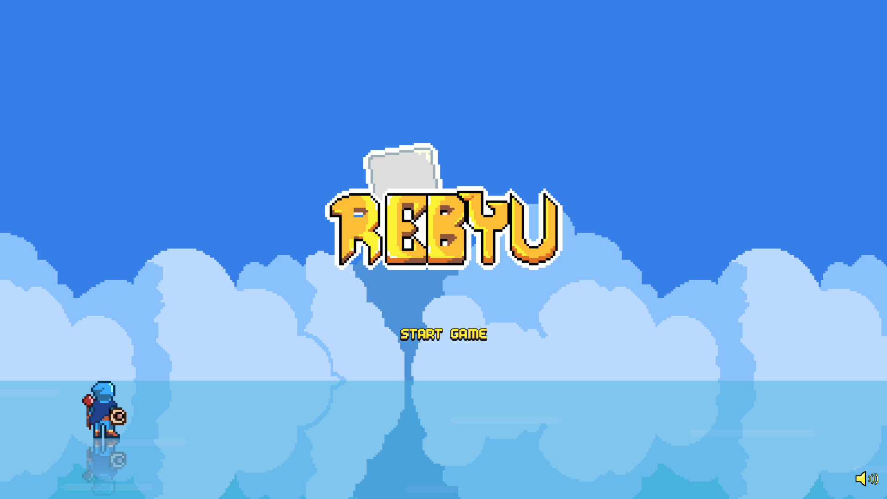
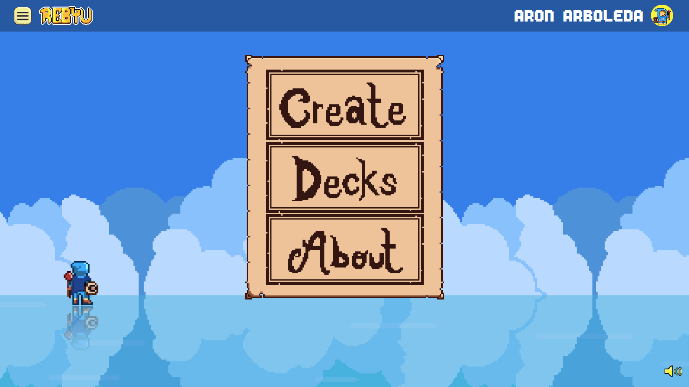
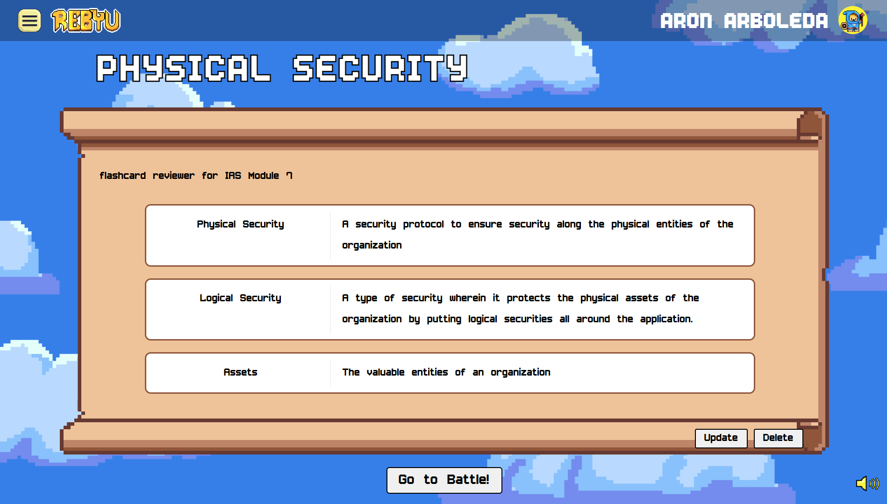
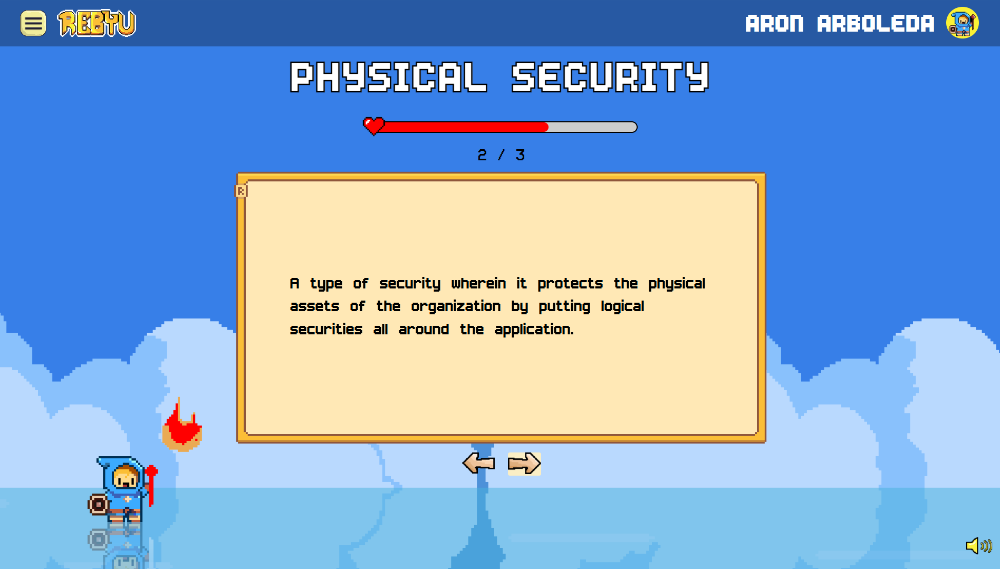
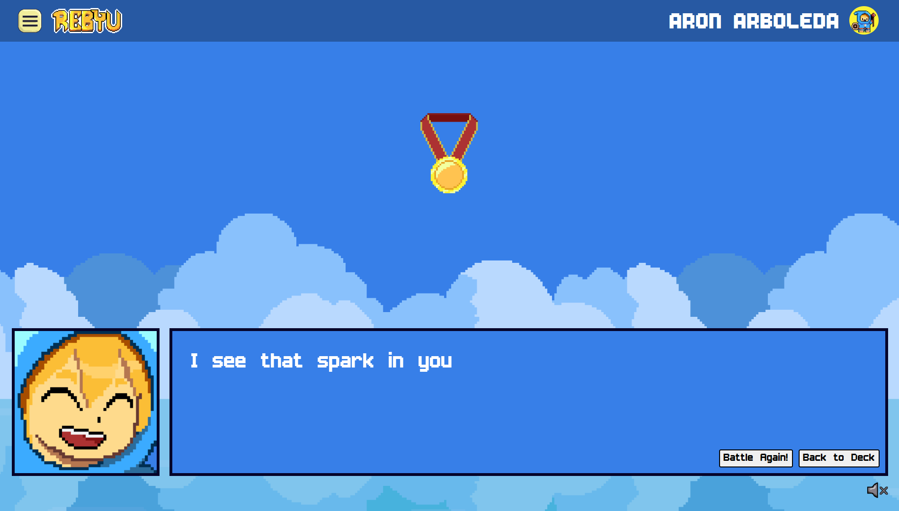

# Rebyu: Gamified Flashcards Web Application

  

## Info

- **Developer**: [Aron-Arboleda](https://github.com/Aron-Arboleda)
- **Project Started**: May 2024
- **License**: [LICENSE](./LICENSE)

## Project Description

REBYU (Review, Educate, Boost, Your Understanding) is a full-stack web application that utilizes pixelated graphics to implement gamified flashcards learning. It's designed to bring a dynamic, game-like experience to studying. Much like Quizlet, it allows users to create, review, and test themselves with digital flashcards, but it stands out by incorporating a vibrant, gamified visual style to make learning more engaging and enjoyable. With REBYU, studying becomes an interactive journey, encouraging users to progress and stay motivated as they explore their chosen topics through playful graphics and thoughtful design.

## Website Link

- **Access REBYU here**: [https://rebyu.ct.ws/](https://rebyu.ct.ws/)

## Features

- **Gamified User Interface**: Engaging pixel-themed graphics to encourage and motivate learning.
- **Account Management**: Secure user registration and login functionalities.
- **Interactive Flashcards Learning**: Dynamic flashcard study sessions with animations and positive reinforcement.
- **Personalized Flashcard Management**: Users can create, edit, and organize their flashcard sets.

## Tech Stack

- **Frontend**: React, Vite, JavaScript, HTML, CSS
- **Backend**: PHP
- **Database**: MySQL
- **Deployment**: InfinityFree

## Features still in development

- Custom domain name
- Features such as shop, experience points, and game currency.
- Additional functionalities such as user folders and collaboration classes like Quizlet.

## REBYU Team

Developer:

- [Aron](https://github.com/Aron-Arboleda)

UI/UX Designer:

- [Alex](https://www.instagram.com/lexsusicat)

Documentation:

- [Jenny](https://www.instagram.com/jentiglao_)
- [Kim](https://www.facebook.com/itsmefantasma)
- [Hetio](https://www.facebook.com/carlohetio)

## Application Images

  

  
  

  
  

## License

- The **code** in this repository is licensed under the [MIT License](./LICENSE).
- All **assets** (e.g., images, icons, sounds, etc.) are **All Rights Reserved** and may not be used, copied, modified, or distributed without explicit permission from the author.

 &copy; 2025 REBYU Team. All rights reserved.
